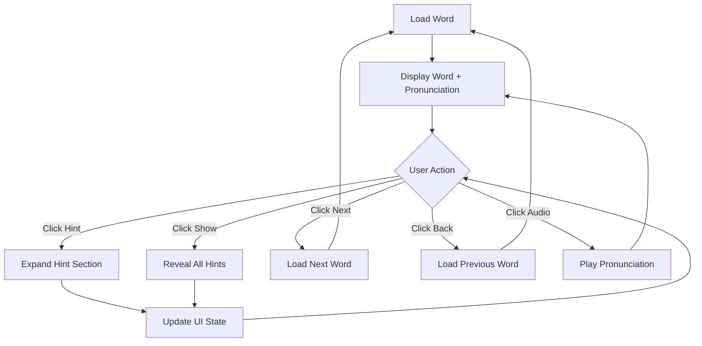

# Learn View - GUI Specification

## Layout Structure

```
┌─────────────────────────────────────────────────────────────┐
│                      LEARN VIEW                             │
├─────────────────────────────────────────────────────────────┤
│  Word: color (UK: colour)                                   │
│  [🔊 US]  [🔊 UK]                                          │
│                                                             │
│  [Back]        [Show]        [Next]                        │
├─────────────────────────────────────────────────────────────┤
│  ┌─────────────────── Hints ───────────────────┐          │
│  │                                              │          │
│  │  [Show Word Type(s)                        ] │          │
│  │  [Show Topic(s)                            ] │          │
│  │  [Show Example(s)                          ] │          │
│  │  [Show Synonym(s)                          ] │          │
│  │  [Show Antonym(s)                          ] │          │
│  │                                              │          │
│  └──────────────────────────────────────────────┘          │
│                                                             │
│  Flag: ●(Green)     Learnt Count: 1     Progress: 1/20     │
└─────────────────────────────────────────────────────────────┘

Error Messages/Tooltips:
💡 "Search must be part of word, not beginning"
💡 "TRong Example, in đám tứ đọng học" 
💡 "Green, Red, White, Yellow, Blue, Gray, etc."
```

## Component Specifications

### Header Section
```yaml
WordDisplay:
  type: Text
  content: "color (UK: colour)"
  style: large, bold

AudioButtons:
  - id: us_pronunciation
    type: IconButton
    icon: speaker
    label: "US"
    action: playUSPronunciation()
  
  - id: uk_pronunciation
    type: IconButton  
    icon: speaker
    label: "UK"
    action: playUKPronunciation()

NavigationButtons:
  - id: back_btn
    type: Button
    text: "Back"
    action: previousWord()
  
  - id: show_btn
    type: Button
    text: "Show"
    action: revealAnswer()
  
  - id: next_btn
    type: Button
    text: "Next" 
    action: nextWord()
```

### Hints Panel
```yaml
HintsContainer:
  type: Panel
  title: "Hints"
  border: true
  
  children:
    - id: word_types_hint
      type: ExpandableButton
      text: "Show Word Type(s)"
      expanded: false
      content: grammar_classification
    
    - id: topics_hint
      type: ExpandableButton
      text: "Show Topic(s)"
      expanded: false
      content: subject_categories
    
    - id: examples_hint
      type: ExpandableButton
      text: "Show Example(s)" 
      expanded: false
      content: usage_examples
    
    - id: synonyms_hint
      type: ExpandableButton
      text: "Show Synonym(s)"
      expanded: false
      content: similar_words
    
    - id: antonyms_hint
      type: ExpandableButton
      text: "Show Antonym(s)"
      expanded: false
      content: opposite_words
```

### Status Bar
```yaml
StatusBar:
  layout: horizontal
  
  components:
    - id: mastery_flag
      type: StatusIndicator
      shape: circle
      color: green
      tooltip: "Word mastered"
    
    - id: learnt_counter
      type: Label
      text: "Learnt Count: 1"
    
    - id: progress_indicator
      type: Label  
      text: "1/20"
      tooltip: "Current word 1 of 20"
```

### Feedback System
```yaml
TooltipMessages:
  - id: search_help
    type: Tooltip
    message: "Search must be part of word, not beginning"
    color: yellow
    arrow: red
  
  - id: example_error
    type: Tooltip
    message: "TRong Example, in đám tứ đọng học"
    color: yellow
    arrow: red
  
  - id: color_examples
    type: Tooltip
    message: "Green, Red, White, Yellow, Blue, Gray, etc."
    color: yellow
    arrow: red
```

## Interaction Flow



## Responsive Behavior

```
Desktop (>768px):
├── Full horizontal layout
├── All components visible
└── Tooltips on hover

Tablet (768px-480px):
├── Stacked navigation buttons
├── Condensed hints panel
└── Touch-friendly buttons

Mobile (<480px):
├── Single column layout
├── Collapsible hints by default
└── Swipe gestures for navigation
```
